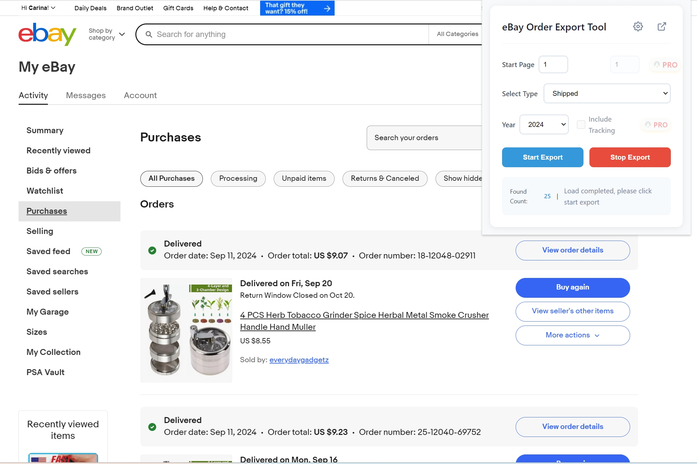

# eBay订单导出助手

## 下载安装

- Chrome网上应用店安装: [点击安装](https://chromewebstore.google.com/detail/ebay-order-export-tool/kifpnlnbboicjkfpicbjegifohgkfbho)
- 离线安装包下载: [ebay-order-export-v1.0.crx](ebay-order-export-v1.0.crx)

## 简介

eBay订单导出助手是一款强大的 Chrome 浏览器扩展，专为 eBay 买家设计。它能够帮助您轻松导出订单数据，提高工作效率。

## 主要功能

- 一键导出 eBay 订单数据
- 支持批量导出功能
- 自动化数据整理
- 支持多种导出格式
- 实时订单同步

## 订阅方案

我们提供灵活的订阅方案：

- 月度订阅：$99/月
- 支持随时取消
- 免费技术支持

## 使用方法

1. 从 Chrome 网上应用店安装插件或下载离线安装包
2. 登录您的 eBay 卖家账号
3. 点击插件图标开始使用
4. 选择需要导出的订单页面起始页和页数
5. 一键导出数据

## 技术支持

如有任何问题，请通过以下方式联系我们：

- 邮件支持：jorchford@gmail.com
- 安全保障
- 数据加密传输
- 隐私保护
- 安全认证
