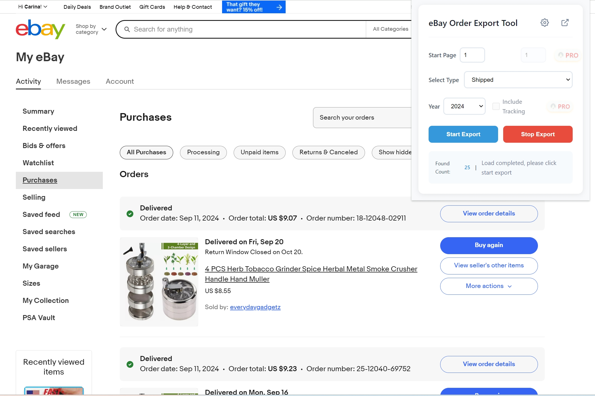

# eBay Order Export Tool

[中文文档](README_CN.md)

## Introduction

eBay Order Export Assistant is a powerful Chrome browser extension designed for eBay buyers. It helps you easily export order data and improve work efficiency.

## Key Features

- One-click eBay order data export
- Batch export support
- Automated data organization
- Multiple export formats support
- Real-time order synchronization

## Subscription Plans

We offer flexible subscription options:

- Monthly subscription: $99/month
- Cancel anytime
- Free technical support

## How to Use

1. Install from Chrome Web Store [Click to Install](https://chromewebstore.google.com/detail/ebay-order-export-tool/kifpnlnbboicjkfpicbjegifohgkfbho)
2. Log in to your eBay seller account
3. Click the extension icon to start
4. Select orders for export
5. Export with one click

## Technical Support

If you have any questions, please contact us through:

- Email Support: jorchford@gmail.com
- Security Guarantee
- Data encryption in transit
- Privacy protection
- Security certification
